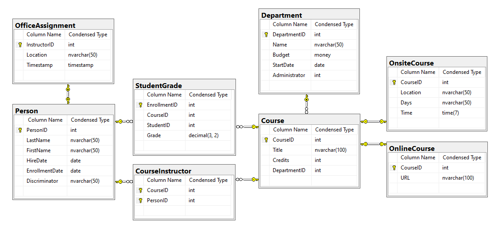

# Text-Em-All Back End Coding Challenge


1. [Requirements](#requirements)
2. [Setup](#setup)
3. [Challenge 1](#challenge-1)
4. [Challenge 2](#challenge-2)
5. [Challenge 3](#challenge-3)
6. [Challenge 4](#challenge-4)
7. [Submission](#submission)

<a name="requirements"></a>
## Requirements

You will need the following to complete this coding challenge:

1. Visual Studio 2017 or 2019
2. SQL Server 2016 or later

<a name="setup"></a>
## Setup

1. Using Visual Studio, create a Web API project.  You may choose to use either
   .NET Framework 4.7 or above, .NET Core 2.1, or .NET Core 3.1.
2. Optionally, add your project to a Git repo.  Although this is not required,
   it is our preferred method to review your code.
3. Using SQL Server, run the `db_scripts\create_tea_test_db.sql` script.  This script will create the `School` database, set up the schema shown below, and populate it with test data.



<a name="challenge-1"></a>
## Challenge 1

Add an endpoint to retrieve a student's transcript given the ID of the student:

```
GET /student/{studentId}/transcript
```

1. If the ID provided does not exist or is not for a student, return the appropriate HTTP status code.
2. The endpoint should return the JSON shown below.
3. Do not include `NULL` grades.
4. The GPA is not stored in the database, so it must be calculated.  For this
   challenge, calculate the GPA in C# code.

```
{
   "studentId":2,
   "firstName":"Gytis",
   "lastName":"Barzdukas",
   "gpa":3.8,
   "grades":[
      {
         "courseId":2021,
         "title":"Composition",
         "credits":3,
         "grade":4
      },
      {
         "courseId":2030,
         "title":"Poetry",
         "credits":2,
         "grade":3.5
      }
   ]
}
```

<a name="challenge-2"></a>
## Challenge 2

Add an endpoint to return a list of students and their GPAs.  

```
GET /students
```

1. The endpoint should return JSON similar to that shown below.
2. There are no restrictions on where the GPA is calculated.  Include a comment in
   your code to justify your approach to calculating the GPA.

```
[
   {
      "studentId":2,
      "firstName":"Gytis",
      "lastName":"Barzdukas",
      "gpa":3.8
   },
   {
      "studentId":3,
      "firstName":"Peggy",
      "lastName":"Justice",
      "gpa":3.4
   },
   ...
   {
      "studentId":30,
      "firstName":"Alicia",
      "lastName":"Shan",
      "gpa":3.75
   }
]
```

<a name="challenge-3"></a>
## Challenge 3

Assuming the database is currently in use, how would you 
modify the `StudentGrade` table to enforce the following rules?

1. If not `NULL`, `Grade` must be a value between `0.00` and `4.00` inclusive.
2. The combination of `CourseID` and `StudentID` must be unique.

Include any script or code to modify the table in the code that you submit.

<a name="challenge-4"></a>
## Challenge 4

Add an endpoint to insert a student grade:

```
POST /grades

{
   "studentId":2,
   "courseId":2030,
   "grade":3.2
}
```

1. `studentId` must be a valid student ID.
2. `courseId` must be a valid course  ID.
3. `grade` must be `null` or a numeric value between `0.00` and `4.00`
   inclusive.
4. A student may only have 1 grade per course.

If the request succeeds, it will return the following JSON:

```
{
   "gradeId":41,
   "studentId":2,
   "courseId":2030,
   "grade":3.2
}
```
 
<a name="submission"></a>
## Submission

1. Make your solution available to us, ideally in a public Git repository.  You
   may also try to email a zipped copy of your solution, but there is a
   chance this will be blocked.  In that case, be prepared to use another
   method, such as Dropbox or Google Drive.
2. Include any special instructions to run your code.